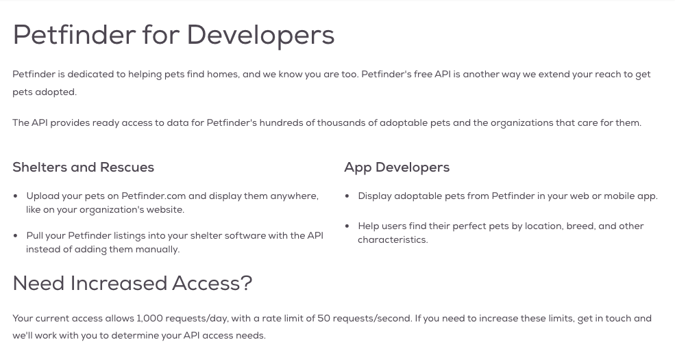
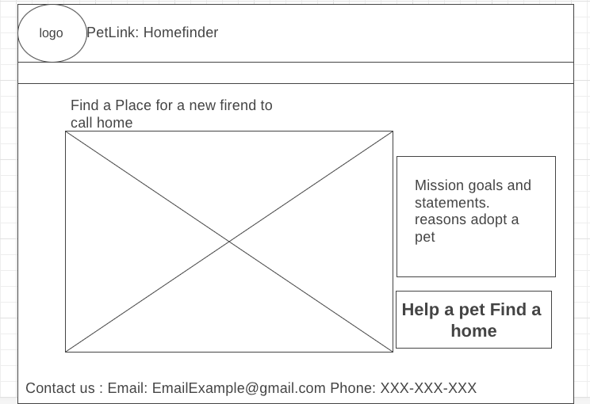
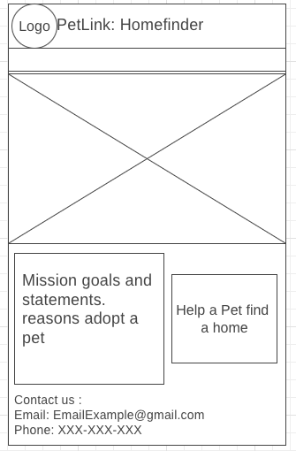

## API: PetFinder API
-------------
1. https://www.petfinder.com/developers/v2/docs/

## Trello
--------------
1. !(https://trello.com/b/bdFY4Qbi/petlink-board)[trello board] 

## User stories
----------------
1. As a pet lover, I want to visit the home page of PetLink HomeFinder so that I can find the link available pets for adoption search.

2. As a potential pet owner, I want to access the search page on PetLink HomeFinder to filter pets by their age ranges. young adult or old

3. As a user looking for a specific type of pet, I want to use the search feature on PetLink HomeFinder to filter pets by their types.(dogs, cats, rabbits)

4. As a user, I should have a straightforward way to return to the home page from the pet adoption page.

5. As a user interested in adopting a pet with specific characteristics, I want to filter pets on PetLink HomeFinder by their breed, size, and color.

6. As a potential pet owner, I want to filter pets on PetLink HomeFinder by the state to find pets available in my area.

7. As a pet adopter, I want to view pet profiles with detailed information, including photos and descriptions, to learn more about each pet.

## Wireframes
---------------

1. This home page seems fine

2. HomePage on mobile is fine 

3. Form is mostly good will need to change depending on search functions

